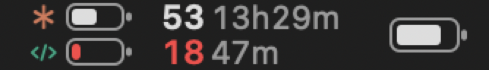
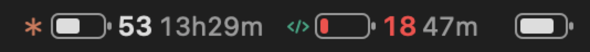
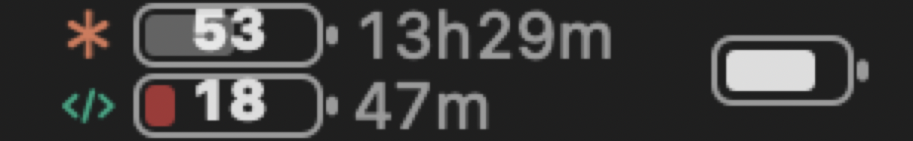

# AI Usage Bar

A tiny macOS menu-bar app that shows how much of your **Claude** (Claude Pro/Max via Claude Code)
and **Codex** (ChatGPT Plus/Pro) usage is left, and how long until each limit resets — drawn like
the system battery indicator.

> Unofficial, personal project. Not affiliated with or endorsed by Anthropic or OpenAI.

| Two rows | One line | Number inside the battery |
|---|---|---|
|  |  |  |

*(Rendered from demo data; the battery at the far right of each image is the system battery glyph,
drawn for size and alignment reference.)*

```
 ✳  [▮▮▯]  53  13h29m        ← Claude: remaining % of the tightest window, time to its reset
‹/› [▯▯▯]  18  47m           ← Codex
```

- Two stacked rows (compare at a glance) or one line. Icons, battery gauge, number, `%` sign,
  number-inside-battery (iPhone style) and time-to-reset are all individually switchable.
- Show Claude only, Codex only, or both. A hidden provider is not polled.
- Red fill and number at 20 % or less, like the macOS battery.
- Click for a popover with every window (5-hour session, 7-day all models, 7-day per-model, Codex
  weekly / 5-hour / add-on limits), a gauge, remaining %, and the reset time. Right-click for
  Refresh / Quit.
- Polls every 5 minutes (and when you open the popover, if the data is older than a minute). A window
  whose reset time has passed is shown as 100 % until the next poll.
- Korean and English UI (follows the system language; can be forced in the popover).
- No dependencies. Swift Package + AppKit/SwiftUI. Builds with the Command Line Tools only.

## Install

Requires macOS 14+ and Xcode Command Line Tools (`xcode-select --install`).

```bash
git clone https://github.com/blackcat610/ai-usage-bar.git
cd ai-usage-bar
./build.sh --install      # builds, copies to /Applications, launches
```

The app is ad-hoc signed, so it is meant to be built from source. Tick **Launch at login** in the
popover to start it with your Mac.

## How it gets the numbers (and why no extra login is needed)

| Provider | Credentials it reuses | Usage endpoint |
|---|---|---|
| Claude | The **Claude Code CLI** login: Keychain item `Claude Code-credentials`, or `$CLAUDE_CONFIG_DIR/.credentials.json` (default `~/.claude`) | `GET https://api.anthropic.com/api/oauth/usage` |
| Codex | The **Codex CLI / ChatGPT app** login in `~/.codex/auth.json` (respects `CODEX_HOME`) | `GET https://chatgpt.com/backend-api/wham/usage` |

So you need to have run `claude` (and signed in) and to be signed in to Codex with a ChatGPT
account. Codex in API-key mode has no usage data.

**Token refresh.** When a stored access token has expired the app refreshes it with the provider's
public OAuth client (the same client id the CLIs use) and **writes the rotated tokens back to the
same place**, exactly like the CLIs do themselves, so your CLI logins keep working. If a refresh
is rate-limited (429) the app backs off for 15 minutes and keeps showing the last values.

**App-specific Claude login.** If you never use the Claude Code CLI (desktop app only), the popover's
*Sign-in settings…* opens a small window for a one-time PKCE login: approve in the browser, paste the
code. The token is stored in the app's own Keychain item (`AIUsageBar / claude-oauth`) and is used
only when no Claude Code login exists. If your account belongs to several organizations, the approval
page uses the browser's current one; a token for an API/Console organization (no Claude subscription)
is rejected with a clear message — switch organization on platform.claude.com and sign in again.

Nothing leaves your machine except the requests to Anthropic and OpenAI above. There is no
telemetry.

## Caveats

- Both usage endpoints are **unofficial**. They are what the vendors' own tools call today; they
  may change or stop working without notice, and using them may sit in a grey area of the
  providers' terms. Use at your own risk.
- The Claude token refresh touches your Claude Code login (rotated tokens are written back). This
  mirrors what Claude Code does on its own, but if you are uneasy about it, use the app-specific
  login instead.
- Keychain access goes through `/usr/bin/security`, so reading the Claude Code item does not prompt.
  The secret briefly appears in the `security` process's arguments when writing (same as Claude Code).

## Development

```bash
./build.sh                                   # build/AIUsageBar.app
build/AIUsageBar.app/Contents/MacOS/AIUsageBar --dump            # fetch both providers, print, exit
build/AIUsageBar.app/Contents/MacOS/AIUsageBar --render-demo x.png  # render menu bar + popover PNGs from fake data
build/AIUsageBar.app/Contents/MacOS/AIUsageBar --render x.png       # same, with live data
```

```
Sources/AIUsageBar/
  App.swift            @main, --dump / --render / --render-demo
  AppDelegate.swift    NSStatusItem, popover, outside-click dismissal, tooltip
  BatteryIcon.swift    Settings, brand colors, battery gauge drawing, StatusView (1/2-row menu bar view)
  UsageStore.swift     @MainActor state, 5-min polling, 30-s tick
  ClaudeProvider.swift token sources (app → Keychain → file), refresh + write-back, PKCE login, parsing
  CodexProvider.swift  auth.json, refresh + write-back, parsing
  Views.swift          SwiftUI popover
  Models.swift / Formatting.swift / L10n.swift / Shell.swift
```

## License

MIT — see [LICENSE](LICENSE).

---

## 한국어

Claude(Claude Code 구독)와 Codex(ChatGPT 구독)의 **잔여 사용량**과 **리셋까지 남은 시간**을 맥 메뉴바에
배터리 표시기처럼 보여주는 개인용 앱입니다.

- 별도 로그인 없이 터미널 `claude` 로그인(키체인 또는 `~/.claude/.credentials.json`)과
  `~/.codex/auth.json`의 ChatGPT 로그인을 그대로 읽습니다. 만료된 토큰은 CLI와 같은 방식으로 갱신해
  같은 자리에 되돌려 씁니다.
- 2줄/1줄, 아이콘, 배터리 바, 잔여 숫자, % 기호, 숫자를 배터리 안에(아이폰식), 남은 시간을 각각 켜고 끌 수
  있습니다. 20% 이하는 빨간색입니다. Claude·Codex 중 원하는 것만 표시할 수도 있습니다.
- 비공식 개인 프로젝트이며 Anthropic·OpenAI와 무관합니다.
- 설치: `./build.sh --install` (macOS 14+, Command Line Tools 필요). 팝오버에서 "로그인 시 실행"을 켜면
  부팅 시 자동 실행됩니다.
- 두 사용량 API는 비공식입니다. 제공자가 바꾸면 동작이 멈출 수 있습니다.
